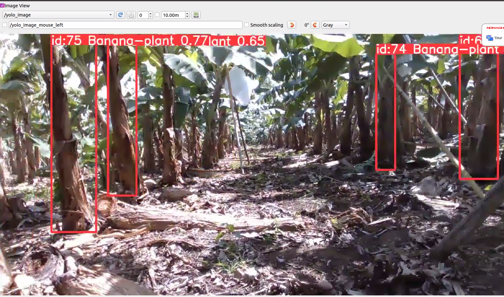

# ROS-Integrated YOLOv8 Banana Plant Detection System

This repository contains the ROS integration for YOLOv8-based banana plant detection using Ultralytics.
Special thanks to Alpaca-zip, upon whose [ultralytics_ros repository](https://github.com/Alpaca-zip/ultralytics_ros)
this work was based.

## Features
- YOLOv8-based object detection
- ROS integration for tracking
- Custom message definitions for detection results
- Docker support

## File Overview
- **launch/tracker.launch**: Launch file to run the tracker node.
- **script/tracker_node.py**: Main ROS node for tracking using YOLO.
- **msg/**: Contains custom ROS messages for YOLO detection results.
- **CMakeLists.txt**: CMake configuration file for building the ROS package.
- **package.xml**: ROS package manifest file.
- **.clang-format / .clang-tidy**: Code style configurations.

## Setup

Run these commands to set up the Ultralytics ROS package for YOLOv8-based banana plant detection:

```
$ cd ~/catkin_ws/src
$ git clone -b noetic-devel https://github.com/LopezJER/ultralytics_ros_banana_plant
$ python3 -m pip install -r ultralytics_ros_banana_plant/requirements.txt
$ cd ~/catkin_ws
$ rosdep install -r -y -i --from-paths .
$ catkin build
```

## Configuring the Tracker
You can initialize and configure the tracker by updating the parameters of the `tracker_node.launch` file.
### Params
- `yolo_model_path`: Pre-trained Weights.  
For yolo_model, you can choose either a path to a "*.pt" (PyTorch) or "*.engine" (TensorRT) file.
  
- `input_topic`: Topic name for input image (e.g. 'realsense/color/image_raw').
- `result_topic`: Topic name of the custom message containing the 2D bounding box and the mask image.
- `result_image_topic`: Topic name of the image on which the detection and segmentation results are plotted.
- `conf_thres`: Confidence threshold below which boxes will be filtered out.
- `iou_thres`: IoU threshold below which boxes will be filtered out during NMS.
- `max_det`: Maximum number of boxes to keep after NMS.
- `tracker`: Tracking algorithms.
- `device`: Device to run the model on(e.g. cpu or cuda:0).
  ```xml
  <arg name="device" default="cpu"/> <!-- cpu -->
  ```
  ```xml
  <arg name="device" default="0"/> <!-- cuda:0 -->
  ```
- `classes`: List of class indices to consider.
  ```xml
  <arg name="classes" default="[0, 1]"/> <!-- banana plant, etc.-->
  ```
- `result_conf`:  Whether to plot the detection confidence score.
- `result_line_width`: Line width of the bounding boxes.
- `result_font_size`: Font size of the text.
- `result_labels`: Font to use for the text.
- `result_font`: Whether to plot the label of bounding boxes.
- `result_boxes`: Whether to plot the bounding boxes.
### Topics
- Subscribed Topics:
  - Image data from `input_topic` parameter. 
- Published Topics:
  - Plotted images to `yolo_result_image` parameter. ([sensor_msgs/Image](https://docs.ros.org/en/api/sensor_msgs/html/msg/Image.html))
  - Detected objects(2D bounding box, mask image) to `result_topic` parameter. (ultralytics_ros/YoloResult)
    ```
  std_msgs/Header header
  DetectionWithTrackID[] detections_with_track_id # custom message structure
  sensor_msgs/Image[] masks
    ```
## Running the Tracker
To launch the tracker, use the following command:
```bash
roslaunch ultralytics_ros tracker.launch debug:=true
```

If no live camera is present, you may play a bag file that publishes the input_topic (e.g. 'realsense/color_image_raw'), like so:
```bash
rosbag play path_to_bag_file.bag
```
## Visualizing and Debugging
View the published outputs of the model by issuign the following command:
```bash
rostopic echo /yolo_result
```

Here's an annotated version of the topic
```
header:  # Message header
  seq: 122  # Sequence number
  stamp:  # Timestamp
    secs: 1677722933  # Seconds since epoch
    nsecs: 125036478  # Nanoseconds
  frame_id: "realsense_color_optical_frame"  # Reference frame for this data

detections_with_track_id:  # List of detections, each with a track ID
  - # First detection
    detection:  # Detection details
      header:  # Header for this specific detection (empty in this case)
        seq: 0
        stamp: 
          secs: 0
          nsecs: 0
        frame_id: ''
      results:  # List of detection results
        - 
          id: 0  # Class ID (e.g., 0 represents a banana plant)
          score: 0.7102630138397217  # Confidence score (about 71%)
          pose:  # Pose information (all zeros in this case)
            pose: 
              position: {x: 0.0, y: 0.0, z: 0.0}
              orientation: {x: 0.0, y: 0.0, z: 0.0, w: 0.0}
            covariance: [0.0, ..., 0.0]  # 6x6 covariance matrix (flattened)
      bbox:  # Bounding box information
        center:  # Center of the bounding box
          x: 140.57601928710938
          y: 273.7142028808594
          theta: 0.0
        size_x: 152.52761840820312  # Width of the bounding box
        size_y: 540.2152709960938  # Height of the bounding box
      source_img:  # Source image information (empty in this case)
        header: {seq: 0, stamp: {secs: 0, nsecs: 0}, frame_id: ''}
        height: 0
        width: 0
        encoding: ''
        is_bigendian: 0
        step: 0
        data: []
    track_id: 122  # Unique ID for tracking this object across frames

  - # Second detection (structure similar to the first)
    detection:
      # ... (similar structure to the first detection)
      results:
        - 
          id: 0
          score: 0.3114513158798218  # Lower confidence score (about 31%)
      bbox:
        center: 
          x: 330.6688232421875
          y: 261.4736633300781
          theta: 0.0
        size_x: 72.28955078125
        size_y: 408.8828430175781
      # ... (rest of the structure is similar)
    track_id: 125  # Different track ID for this detection
```
To visualize the results of the tracker, use the following command and view the /yolo_result topic:
```bash
rqt_image_view
```



